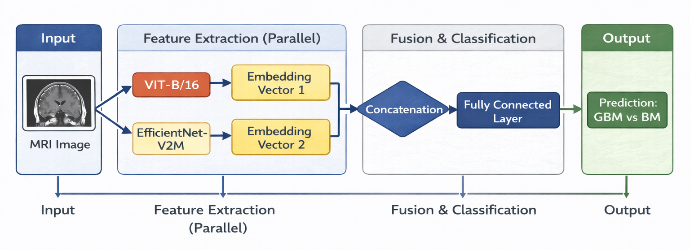

# MRI Tumor Classification — Hybrid CNN & Vision Transformer Model
Classification of Glioblastoma and Brain Metastasis Using a Hybrid EfficientNet–Vision Transformer Architecture

## 🧠 Model Architecture

**Hybrid CNN–Vision Transformer Architecture for MRI-based Brain Tumor Classification**



The input MRI image is processed in parallel by two independent feature extractors — ViT-B/16 and EfficientNet-V2M.  
Each network produces a high-level embedding vector. The resulting representations are concatenated and passed through a fully connected classification layer to generate the final prediction (GBM vs BM).

## Introduction

This repository implements a hybrid deep learning model combining EfficientNetV2M and ViT-B16 to classify glioblastoma (GBM) and brain metastases (BM) using MRI images. The model integrates EfficientNetV2M and ViT-B16 architectures to leverage the complementary strengths of convolutional neural networks (CNNs) and Vision Transformers (ViTs) to optimize tumor classification performance.  
Additionally, the repository supports the standalone use of EfficientNetV2M, ViT-B16, and ResNet-50 as individual architectures.


## Directory Structure

- `config.py` - Imports configuration settings from configs
- `eval.py` - Evaluation utilities
- `main.py` - Main entry point for running the project
- `inference_predict.py` - Inference and prediction script
- `train.py` - Model training script
- `train_loop.py` - Training loop utilities
- `requirements.txt` - Dependency requirements
- `configs/` - Configuration files
- `Dataset/` - Dataset files
- `data_utils/` - Data processing utilities
- `models/` - Neural network models
- `results/` - Output results and run logs
- `utils/` - Additional utility functions
- `weights/` - Pre-trained model weights for all models. Will be automatically downloaded when inference or predict is performed.


## Installation

- **Clone the repository:**
  ```bash
  git clone https://github.com/moralon2210/HybridEffNetV2M-ViT.git
  cd HybridEffNetV2M-ViT

- **Install dependencies:**
  ```bash
  pip install -r requirements.txt

## Usage

- **Train the model:**

  Trains the model using train_config.json configurations.

  ```bash
  python main.py --mode train

- **Run inference (Evaluation with Ground Truth):**
  
  Runs inference on MRI data with ground truth to evaluate model performance, using inference_config.json configurations.

  ```bash
  python main.py --mode inference

- **Generate predictions (Without Ground Truth):**

  Produces predictions on MRI scans without ground truth, using predict_config.json configurations.

  ```bash
  python main.py --mode predict

## Configuration

- **Modify settings in the ****`configs/`**** directory** to adjust training parameters, data paths, and model settings.

## Dataset

- **Place dataset files in the ****`Dataset/`**** directory.**
- Ensure that the file structure matches the expected format (examples are provided within the folder).

## Results

- **Model outputs, logs, and performance metrics** are automatically saved.
- **Results are stored in the ****`results/`**** directory,** organized by mode.

## Pre-trained Weights

- **Available in the ****`weights/`**** directory**
- Weights directory will be automatically downloaded once inference or predict are performed.
- Includes pre-trained weights for hybrid EffNetV2M-ViT, EfficientNetV2M, ViT-B16 and ResNet-50.
- These weights are **trained over 5 folds and are used during inference and prediction modes** to generate results.


